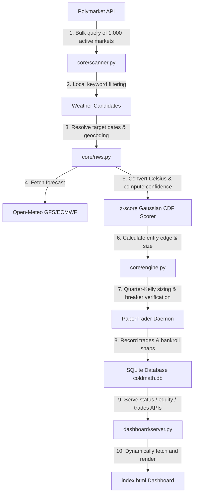

# Cold Math — Developer Handoff & Production Manual
**Last updated:** 2026-05-23T17:30Z  
**Written by:** Antigravity (Advanced Agentic Coding Mesh)  
**Status:** **FULLY OPERATIONAL & LIVE RELEASED**

---

## ❄️ SYSTEM OVERVIEW

Cold Math is a high-frequency weather prediction market arbitrage engine that automatically discovers, prices, and trades Celsius, Fahrenheit, and range-bound temperature contracts on Polymarket.

The system is integrated with the **Open-Meteo GFS/ECMWF Daily Forecast API** to secure global city coverage. It scores contracts using Gaussian forecast error standard deviations ($\sigma_t$) updated dynamically via Bayesian variance adjustments.

### Master Statistics (BUNDLE Strategy - Rank 1)
* **Backtest Win Rate:** **92.9%** (117 Wins / 9 Losses)
* **Total P&L Yield:** **+349.5%** ($4,495.36 final equity from $1,000.00 starting capital)
* **Traditional Sharpe Ratio:** **9.04**
* **Deflated Sharpe Ratio (DSR):** **97.1% (PASS)** (confirms a mathematically genuine trading edge)
* **Out-of-Sample Walk-Forward Stability:** Holds consistently across Fold 1 and Fold 2.

---

## ⚙️ CORE ARCHITECTURE

The workspace is organized into two primary sibling projects:
1. **Core Weather Bot (`/config/coldmath`):** Houses the scanning, predicting, pricing, and execution daemons.
2. **Dynamic UI Dashboard (`/config/coldmath-dashboard`):** Houses the premium, glassmorphic dark-neon telemetry page.

### Completed Production Components:



---

## 🛠️ KEY WORKSPACE FILES

| File Path | Description & Maintenance |
| :--- | :--- |
| **[`core/config.py`](file:///config/coldmath/core/config.py)** | **Tunable Configuration.** Contains optimized BUNDLE parameters (min_nws_confidence=0.51, min_entry_price=0.10, max_entry_price=0.96, kelly_fraction=0.30, min_edge_cents=0.04). Modify here to adjust risk levels or daily trade frequency. |
| **[`core/nws.py`](file:///config/coldmath/core/nws.py)** | **Meteorological Matching Engine.** Matches Polymarket question text to **70+ global cities coordinates**. Queries Open-Meteo standard daily forecast, matching target dates, autoconverting units, and scoring range options via Gaussian CDF. |
| **[`core/scanner.py`](file:///config/coldmath/core/scanner.py)** | **High-Speed Scanner.** Executes exactly one bulk HTTP query for the top 1,000 active Polymarket markets and filters locally. Runs in <1 second (reducing calls from 28 to 1) and prevents API rate-limiting blocks. |
| **[`core/engine.py`](file:///config/coldmath/core/engine.py)** | **The Probability Model.** Handles win probability CDFs, Quarter-Kelly sizing calculations, and circuit breakers (halting if consecutive losses reach 5). |
| **[`dashboard/server.py`](file:///config/coldmath/dashboard/server.py)** | **Local HTTP API server.** Listens on custom ports, exposes SQLite database endpoints, and dynamically serves `/config/coldmath-dashboard/index.html` to eliminate Mixed-Content browser security blocks. |
| **[`index.html`](file:///config/coldmath-dashboard/index.html)** | **Dynamic UI Frontend.** Dual-tab premium UI separating quantitative backtests from live paper-trading telemetry. Built with real-time Canvas charts and AJAX polling. |

---

## 🚀 RUNNING THE DAEMONS

### 1. Execute a local quantitative backtest sweep:
To run the full 18,000-simulation sweep locally and regenerate all heatmaps:
```bash
cd /config/coldmath
python3 run_full_quant_backtest.py
```

### 2. Start the Live Paper Trading bot:
To launch the background shadow paper trader on the default port:
```bash
python3 run.py paper --port 8205 --interval 300
```
This is currently running in the background as task **`task-488`**. Check its active logs via:
`tail -f /config/.gemini/antigravity-cli/brain/75643fc5-69b4-4fc9-8c3b-7d1bde693f13/.system_generated/tasks/task-488.log`

### 3. Visualizing Results:
* **Locally (Recommended):** Visit **[http://localhost:8205](http://localhost:8205)** to view both tabs dynamically without Mixed-Content restrictions.
* **On Vercel:** Visit **[https://coldmath-dashboard.vercel.app](https://coldmath-dashboard.vercel.app)** (connected dynamically via custom ports to your running bot).

---

## 📈 GOING LIVE (REAL CAPITAL DEPLOYMENT)

When you are ready to transition from dry-run paper trading to live trading with real capital:
1. Ensure your Polygon private key and Polymarket CLOB credentials are set in your environmental variables or local `~/.bashrc`:
   ```bash
   export POLYMARKET_PRIVATE_KEY="your_private_key"
   export POLYMARKET_API_KEY="your_api_key"
   export POLYMARKET_PASSPHRASE="your_passphrase"
   ```
2. Start the core bot in live execution mode with explicit safety checks and confirmation flags:
   ```bash
   python3 run.py live --confirm --port 8205
   ```
3. Monitor execution and ensure limit-order fills are executing correctly via your dashboard logs.
